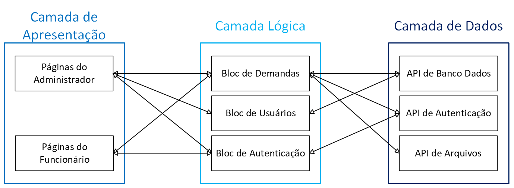
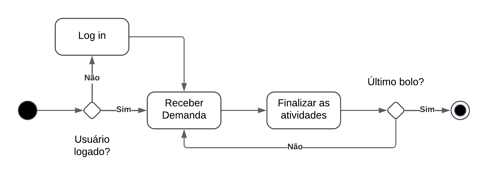
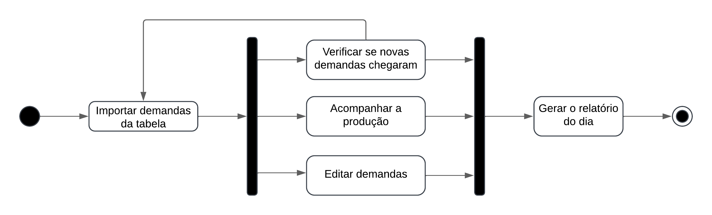
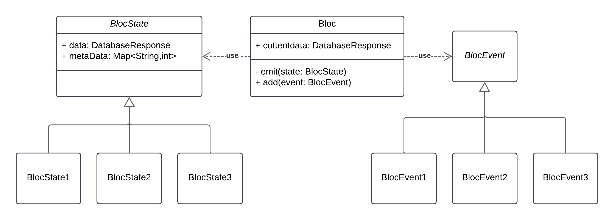

# DOCUMENTO DE ARQUITETURA

## Histórico de Revisões

| Versão |    Data    | Descrição da Alteração | Nome(s) Integrante(s) |
| :----: | :--------: | :--------------------: | :-------------------: |
| 0.1 | 07/12/2024 | Início do documento  | Henrique Bernardes |
| 0.2 | 07/12/2024 | Redação das definições | Leticia Higa |
| 0.3 | 08/12/2024 | Redação da justificativa e detalhamentos | José Augusto |
| 0.4 | 09/12/2024 | Redação inicial de visão de casos de uso | Pedro Henrique |
| 0.5 | 13/12/2024 | Redação inicial de visão de implantação | Maria Samara |
| 0.6 | 13/12/2024 | Redação inicial da visão de implementação | José Augusto |
| 0.7 | 15/12/2024 | Redação das metas e restrições arquiteturais. | Leticia Higa |
| 0.8 | 16/12/2024 | Redação visão de implementação | Daniel Fernandes |
| 0.9 | 16/12/2024 | Redação inicial restrições adicionais | Maria Samara |
| 0.10 | 17/12/2024 | Redação da visão lógica | Danniele e José Augusto |
| 0.11 | 17/12/2024 | Redação visão de implementação | Daniel Fernandes |
| 0.12 | 17/12/2024 | Redação das restrições adicionais | Gabriela Dourado |
| 0.13 | 18/12/2024 | Complementando a visão de implementação e revisando | Mariana Pereira |

## Autores

| Matrícula | Nome | Descrição do Papel Assumido na Equipe | % Contribuição ao trabalho |
| :-------: | :--: | :-----------------------------------: | :------------------------: |
| 222008459 | Daniel | Desenvolvedor Frontend | |
| 231012058 | Danielle | Desenvolvedora Frontend | |
| 231026821 | Gabriela | Desenvolvedor Backend | |
| 231026429 | José | Desenvolvedor Backend | |
| 231012272 | Leticia | Desenvolvedor Frontend | |
| 222037577 | Maria Eduarda | Desenvolvedora Backend, analista de qualidade | |
| 231027005 | Maria Samara | Desenvolvedora Frontend | |
| 232029210 | Mariana | Desenvolvedora Frontend | |
| 231026545 | Pedro | Desenvolvedor Backend, Banco de Dados | |

## 1. Introdução

### 1.1. Propósito

Este documento descreve a arquitetura do sistema sendo desenvolvido pelo grupo 4 – Runa Fehu – na disciplina de MDS – Métodos de Desenvolvimento de Software – edição do segundo semestre de 2024, Gestão Catavento, buscando fornecer uma visão abrangente do sistema para quaisquer interessados, sejam eles desenvolvedores, testadores e demais. O objetivo principal deste documento é apresentar as decisões arquiteturais, os componentes do sistema, suas interações e tecnologias utilizadas para facilitar o entendimento do projeto, auxiliar na implementação e garantir a qualidade do desenvolvimento. 

### 1.2. Escopo

O detalhamento completo do escopo se encontra no documento de visão. Porém, resumidamente, o sistema a ser desenvolvido trata-se de um aplicativo voltado para tablets android, com foco em auxiliar as demandas da empresa Catavento, que vende bolos fakes. O aplicativo para a loja de bolos tem como objetivo otimizar a comunicação e organização das tarefas entre os membros da equipe. Inicialmente, o foco está em facilitar o gerenciamento das atividades internas da equipe por meio de uma lista de tarefas compartilhada em tempo real, utilizando o Supabase para sincronizar informações entre os dispositivos. As funcionalidades principais incluem a criação, edição e exclusão de tarefas, categorização de status (como "Pendente", "Em andamento" e "Concluído"), e controle de permissões, garantindo que apenas usuários autorizados possam realizar determinadas ações. Ele será implementado utilizando as tecnologias Flutter, para o *frontend*, Dart, para o *backend* e o Supabase como banco de dados, garantindo eficiência, escalabilidade e boa experiência do usuário. 

## 2. Representação Arquitetural

### 2.1. Definições

O sistema seguirá uma arquitetura BLoC (Business Logic Component), uma arquitetura padrão amplamente utilizada no Flutter. Essa arquitetura separa as regras de negócio da interface do usuário, tornando o código rápido, fácil de testar e reutilizável. O BLoC utiliza *streams* (fluxos de dados) para gerenciar a comunicação entre a interface e as regras de negócio. Em geral, a arquitetura é composta por três camadas principais: a interface de usuário, o componente BLoC e a camada de dados. 

A interface de usuário é responsável pela renderização e captura das interações, mas não contém lógica de negócios, ela apenas responde aos estados enviados pelos Blocs. O componente Bloc é onde ocorre a lógica de negócios, recebendo os eventos da interface, processando-os conforme as regras de negócios e enviando novos estados para a interface. A camada de dados é responsável por fornecer os dados necessários ao Bloc.

### 2.2. Justificativa

A arquitetura BLoC foi selecionado pois a divisão dos componentes de software propiciado pela arquitetura ajuda no desenvolvimento e na realização de testes pois diminui o acoplamento e aumenta a coesão do sistema, além de ajudar no gerenciamento de estado da aplicação. Além disso, a arquitetura BLoC foi escolhida por ser bem estabelecida no desenvolvimento de aplicativos Flutter, tendo sido apresentada pela Google, criadora do Flutter, no Google I/O 2018 e posteriormente amplamente adotada por desenvolvedores que utilizam o *framework*.

Se tratando de testes, a arquitetura BLoC facilita a execução de testes, pois como os *blocs* que formam a camada lógica são desacoplados da camada de apresentação e de outros *blocs* testar um *bloc* específico não apresenta qualquer dificuldade, e como cada operação de um *bloc* é chamada por eventos específicos com um estado retornado previsível, a interpretação dos testes é intuitiva e a origem dos erros é de fácil identificação.

### 2.3. Detalhamento

Utilizando a arquitetura BLoC o sistema é dividido em três camadas, uma camada de apresentação, outra de lógica e a última de dados, que são responsáveis respectivamente pela:  

1. Comunicação com o usuário final, isto é, tanto a parte gráfica quanto o recebimento de *inputs*;
2. Comunicação com as duas outras camadas, a camada de lógica recebe os inputs da camada de apresentação, realiza chamadas a camada de dados e depois passa as informações recebidas, já processadas, para a camada de apresentação;  
3. Armazenar e disponibilizar os dados do sistema para que a camada lógica possa processar esses dados e enviá-los a camada de apresentação;  

No caso do sistema desenvolvido pela equipe, teremos as páginas do administrador e do funcionário na camada de apresentação se comunicando com os blocs de demandas, usuários e autenticação na camada lógica. Por fim a camada lógica se comunicará com camada de dados que é baseada nas APIs do Supabase. As interações entre cada uns dos elementos podem ser observadas na Figura 1 a seguir.

É importante notar que elementos de uma mesma camada não devem se comunicar entre si, a fim de evitar um alto acoplamento, além disso a camada de apresentação não se comunica diretamente com a camada de dados, isto a fim de concentrar a lógica nos *Blocs* de forma que a lógica seja reusável e mais fácil de manter. 

**
Figura 1: Esquema de Camadas do Sistema
**

**
Fonte: autoria própria (2024)
**

### 2.4. Metas e Restrições Arquiteturais

### 2.5. Visão de Casos de Uso (escopo do produto)

**
Figura 2: Diagrama de Casos de Uso
**

**
Fonte: autoria própria (2024)
**

O sistema suportará três tipos de usuário: o funcionário; e dois tipos de administrador, sendo o gerente de departamento e o administrador de gerentes.

O administrador, em geral, será capaz de gerenciar demandas individualmente e através de importação de planilha Excel. Ele também será capaz de visualizar o desempenho de funcionários e estabelecer metas. O gerente de demandas será capaz de gerenciar contas de usuário funcionário. O administrador de gerentes, por sua vez, será capaz de gerenciar contas de usuário funcionário e de gerentes de departamento. Adicionalmente, o administrador poderá gerar relatórios de produtividade referentes a determinado período.  

O usuário funcionário será capaz de visualizar uma demanda por vez e aceitar a tarefa correspondente a seu departamento. Ele será capaz de visualizar seu progresso em sua própria meta de produção diária, e o seu próprio desempenho (quantidade de tarefas entregues por dia).

### 2.6. Visão Lógica 

O sistema é subdividido nos seguintes módulos: autenticação, gestão de demandas, gestão de funcionários, geração de relatórios e distribuição de tarefas. Cada módulo foi projetado com base em uma lógica que reflete as necessidades da cliente, garantindo que as funcionalidades estejam organizadas de maneira eficiente e fácil de manter. 

O módulo de autenticação é responsável por controlar o acesso ao sistema e distinguir os perfis de usuários (administrador e funcionário), bem como atribuir permissões específicas a cada um. Esse módulo foi assim pensado para que apenas os administradores pudessem ter o controle total sobre todas as demandas a serem produzidas no dia, enquanto os funcionários pudessem apenas acessar informações sobre as demandas que eles devem produzir no momento.  

O módulo de gestão de demandas, acessível aos administradores, centraliza o controle do processo produtivo. Ele permite o cadastro de novas demandas, o acompanhamento do progresso de cada tarefa na linha de produção e a definição de prioridades. De forma semelhante, o módulo de gestão de funcionários facilita o gerenciamento de perfis de usuário. Este módulo permite que os administradores cadastrem, editem e excluam perfis de funcionários. 

O módulo de geração de relatórios reúne informações históricas sobre as demandas concluídas, auxiliando os gerentes na análise do desempenho produtivo. Ele também inclui dados sobre os funcionários, como o tempo médio para conclusão de atividades e o número de tarefas finalizadas diariamente. Por outro lado, o módulo de distribuição de tarefas é acessível apenas aos funcionários. Nele, os usuários visualizam as tarefas que precisam executar e têm acesso apenas às etapas de produção em que estão diretamente envolvidos, sem acesso às demais etapas do processo. 

Quanto às interfaces do sistema, o módulo de autenticação funciona como a camada inicial, determinando as permissões de acesso com base no perfil do usuário. Os administradores têm acesso aos módulos de gestão de demandas, gestão de funcionários e geração de relatórios, enquanto os funcionários interagem exclusivamente com o módulo de distribuição de tarefas. De forma integrada, os módulos se comunicam para garantir a sincronia das informações. O módulo de gestão de demandas alimenta o módulo de distribuição de tarefas, que atribui as atividades específicas aos funcionários. Informações geradas nesse processo são enviadas aos módulos de gestão de funcionários e de geração de relatórios para atualização de dados. Assim, a interação entre esses módulos alimenta um fluxo contínuo de informações. 

A seguir, serão apresentados dois diagramas de estados que descrevem o fluxo de sessão de um usuário funcionário e um usuário administrador dentro do sistema, detalhando as possibilidades de navegação de cada um, desde o início até o término de sua sessão. Ambos os processos iniciam com a autenticação do usuário, que caso bem bem-sucedida, o redireciona para uma página inicial. Da mesma forma, nos dois casos as sessões finalizam quando a autenticação não é bem-sucedida ou o próprio usuário opte por encerrar a sessão. 

No diagrama da Figura 3, é possível observar que, após a autenticação, o usuário funcionário é redirecionado para a página de quadro de tarefas, onde ele pode visualizar e interagir com as atividades que lhe foram atribuídas. Além disso, o funcionário tem acesso a um menu que oferece atalhos para realizar o logout ou acessar seus dados pessoais. 

**
Figura 3: Diagrama de Estados de Sessão do Usuário Funcionário
**

**
Fonte: autoria própria (2024)
**

Em seguida, o diagrama da Figura 4 mostra o fluxo de sessão do usuário administrador. Após a autenticação, o administrador é redirecionado para a página principal de administração, que por padrão é a de gestão de demandas. A partir dessa página, o administrador pode acessar diferentes áreas do sistema por meio do menu, incluindo o cadastro e visualização de produtos, a administração de funcionários, a gestão de demandas e o atalho de logout. 

**
Figura 4: Diagrama de Estados de Sessão do Usuário Administrador
**

**
Fonte: autoria própria (2024)
**

O fluxo de atividades da aplicação pode ser dividido em dois, baseados no tipo de usuário, um fluxo para o administrador e o outro para o funcionário. O fluxo de atividades do funcionário envolve simplesmente em iniciar a sessão do seu dispositivo e receber demandas e finalizar demandas recebidas do administrador até que todas sejam completas, o que é mostrado na Figura 5 a seguir

**
Figura 5: Diagrama de Atividades do Funcionário
**

**
Fonte: autoria própria (2024)
**

O fluxo de atividades do administrador consiste em importar os bolos que serão produzidos durante o dia de uma planilha e, ao decorrer do dia, acompanhar o processo produtivo usando o aplicativo, eventualmente adicionando, editando ou removendo demandas conforme a necessidade. Por fim, o administrador recebe um relatório contendo o tempo médio que os funcionários levaram para fabricar cada produto, com a possibilidade de visualizar o desempenho de funcionários individuais ou do departamento inteiro. Este fluxo é ilustrado na Figura 6 abaixo. 

**
Figura 6: Diagrama de Atividades do Administrador
**

**
Fonte: autoria própria (2024)
**

A comunicação entre os módulos ocorre de forma indireta através de blocs, que são responsáveis por mediar as interações entre a camada de apresentação e a camada de dados. Essa estrutura garante baixo acoplamento entre os módulos, permitindo que cada um opere de forma independente e sem dependências diretas. De forma resumida, qualquer dado necessário para as funções de um módulo é adquirido ou da camada de apresentação ou da camada de dados por meio de objetos da classe Event ou chamadas da Api do Supabase.

Os dados são persistidos localmente pela aplicação nos vários blocs que compõem a camada lógica da aplicação, esses blocs realizam chamadas ao banco de dados baseados em events que são adicionados aos blocs por meio do método add e disponibilizam as informações recebidas por meio da emissão de um State por meio do método emit, no caso de operações que não necessitam de uma nova chamada ao banco de dados, por exemplo quando é apenas necessário apenas filtrar os dados já armazenados, o bloc é responsável por processar os dados armazenados e envia-los a camada de apresentação. 

Na figura 7 abaixo é representado uma configuração básica e genérica de como um bloc armazena as informações e as classes utilizadas para a comunicação com a camada de apresentação, note que currentData e data são do tipo DatabaseResponse um nome dado para os dados recebidos do banco de dados que são do tipo List<Map<String,dynamic>>.

**
Figura 7: Diagrama de Classes
**

**
Fonte: autoria própria (2024)
**

### 2.7. Visão de Implementação

A aplicação terá quatro pacotes principais: **Screens**, **Blocs**, Supabase, e **Services**. A interação com o usuário é responsabilidade das páginas e **widgets** contidos no pacote **Screens** que por sua vez depende das classes e funções definidas tanto no pacote **Blocs** como no pacote Services, que disponibiliza funções para importação de dados vindos de arquivos do dispositivo.

A comunicação com o banco de dados é realizada através da classe **Client** do pacote Supabase Flutter, uma biblioteca desenvolvida pelo Supabase que permite a realização de requisições para o **backend** como serviço. Por fim, a comunicação entre a camada de apresentação e o banco de dados é intermediada pelas classes do pacote **Blocs** que além de simplesmente atuarem como as pontes de comunicação entre o usuário e o banco de dados também guardam em si a lógica de negócios da aplicação. A interação entre esses pacotes e a as classes que os compõem, de forma simplificada, pode ser vista na Figura 8 abaixo. O diagrama ilustra como o pacote **Screens** interage diretamente com os pacotes Blocs e Services, enquanto o Blocs realiza as requisições ao banco de dados por meio do pacote Supabase. Além disso, destaca-se que **Services** fornece funcionalidades auxiliares ao Screens, como importação de dados. Essa divisão garante uma arquitetura modular e facilita a manutenção e evolução do software. 

**
Figura 8: Diagrama de Pacotes
**

**
Fonte: autoria própria (2024)
**

### 2.8. Visão de Implantação

### 2.9. Restrições Adicionais

## 3. Bibliografia

ALURA. **O que é Flutter? O Framework do Iniciante ao Avançado**. 2023. Disponível em: <https://www.alura.com.br/artigos/flutter?srsltid=AfmBOorUEUJL41Ic2Su7wjTpL7NKLdhUQ2dYdDMhPqwyBBAVQ-sZlJwe>. Acesso em: 13 de dezembro de 2024.

FLUTTER. **Flutter architectural overview**. 2024. Disponível em: <https://docs.flutter.dev/resources/architectural-overview>. Acesso em: 13 de dezembro de 2024. 

SUPABASE. **Auth architecture**. 2024. Disponível em: <https://supabase.com/docs/guides/auth/architecture>. Acesso em: 16 de dezembro de 2024.

DEVIN INTERFACE. **A Supabase overview**. Disponível em: <https://www.devinterface.com/en/blog/a-supabase-overview>. Acesso em: 17 dezembro 2024. 

WELL. **Supabase, uma plataforma de desenvolvimento de aplicativos web**. Disponível em: <https://leoandrade.net/supabase-uma-plataforma-de-desenvolvimento-de-aplicativos-web/>. Acesso em: 17 dezembro 2024. 