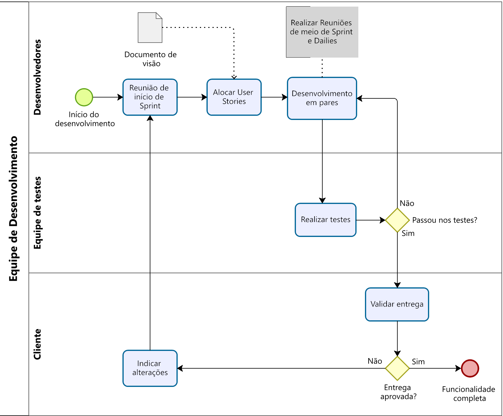

# [VISÃO DO PRODUTO E PROJETO](https://unbbr.sharepoint.com/:w:/r/sites/MDS20242/_layouts/15/Doc2.aspx?action=edit&sourcedoc=%7B4ffe2197-4db2-4cbc-88df-397200886215%7D&wdOrigin=TEAMS-WEB.teamsSdk_ns.rwc&wdExp=TEAMS-TREATMENT&wdhostclicktime=1733011856568&web=1)

| Versão | Data | Descrição da Alteração | Nome(s) Integrante(s) |
| :----: | :--: | :--------------------: | :-------------------: |
| 0.1 | 14/11/2024 | Redação inicial do capítulo 1, pendente alinhamento de ideias com a equipe.  | José Augusto |
| 0.2 | 15/11/2024 | Instanciação do diagrama de ciclo de vida, justificativa da excolha do ScrumXP como metodologia e composição da organização do projeto | Henrique Bernardes e Letícia Arisa |
| 0.3 | 22/11/2024 | Escrita inicial do capítulo 3, descrevendo o processo de desenvolvimento de software | José Augusto, Gabriela Dourado e Maria Samara Alves |
| 0.4 | 22/11/2024 | Escrita dos perfis e composição da tabela de backlog do produto | Henrique Bernardes, José Augusto e Maria Eduarda Quaresma |
| 0.5 | 25/11/2024 | Continuação da composição da tabela de backlog e escrita dos cenários | Henrique Bernardes | 
| 0.6 | 25/11/2024 | Escrita da matriz de comunicação  | Maria Eduarda Quaresma e Danielle Soares  | 
| 0.7 | 27/11/2024 | Escrita do gerenciamento de riscos | Mariana Pereira |
| 0.8 | 29/11/2024 | Detalhamento nos tópicos de “planejamento de fases e/ou iterações do projeto,” “cenários” e “tabela do backlog”. | Henrique Bernardes |
| 0.9 | 02/12/2024 | Escrita final dos tópicos “matriz de comunicação”, “gerenciamento de riscos” e “critérios de replanejamento”. | Maria Eduarda e  Mariana Pereira |
| 1.0 | 02/12/2024 | Revisão final para entrega | Henrique Bernardes |
| 1.1 | 06/12/2024 | Adaptação do backlog das sprints 2, 3 e 4 de acordo com as demandas relacionadas a refatoração do código de acordo com a arquitetura | Henrique Bernardes |
| 1.2 | 10/12/2024 | Revisão da tabela de organização da equipe e retificação feita sobre a matriz de comunicação | José Augusto |

## 1 VISÃO GERAL DO PRODUTO

### 1.1 Produto

A empresa Catavento, cliente da equipe Fehu, é especializada na manufatura e comercialização de produtos para festas, com destaque para os bolos "fakes". No momento, o processo produtivo desses bolos é gerenciado de maneira informal e manual, utilizando uma planilha de demandas. Esta planilha é impressa e distribuída entre os departamentos responsáveis. Após a conclusão das demandas, os funcionários registram as informações diretamente na planilha, o que pode gerar inconsistências e dificultar o acompanhamento do processo.

Além disso, a cliente mencionou situações em que os funcionários, conscientes de todas as demandas futuras, tendem a priorizar a entrega de tarefas mais simples em detrimento das que exigem maior esforço. 

Nesse contexto, surge a oportunidade de implementar uma solução tecnológica que centralize o controle das demandas. Essa abordagem permitirá que: 

- Gerentes de cada departamento tenham acesso em tempo real ao status de cada demanda, assegurando um melhor controle da produção. 
- Funcionários possam visualizar apenas a demanda atual, evitando a priorização de tarefas específicas em detrimento de outras, o que promoverá uma gestão mais equilibrada e eficiente das atividades. 

### 1.2 Declaração de Posição do Produto 

Após a identificação do problema e da oportunidade de solução mencionados anteriormente, apresentamos no Quadro 1, a seguir, a declaração de posição do produto. Esta declaração compila as informações essenciais sobre a visão da equipe em relação ao produto a ser desenvolvido, as necessidades que ele atende e sua posição no mercado atual. 

**
Quadro 1: Declaração de Posição do Produto
**

|                      |                                                     |
|       ----:          | :----                                               |
| Para:                | Empresa Catavento                                   |
| Necessidade:         | uma solução tecnológica para a gerência de demandas |
| O (nome do produto): | Catavento é um App mobile                           |
| Que:                 | centraliza as demandas de cada departamento, permitindo o lançamento e acompanhamento de demandas em tempo real pelos gerentes e a apresentação das demandas em forma estritamente sequencial aos funcionários |
| Ao contrário:        | tecnologias voltadas para o gerenciamento de projetos como o Trello ou o Slack poderiam substituir o método atual de gerenciamento |
| Nosso produto:       | porém, o Catavento será uma ferramenta especializada em atender nas necessidades da cliente, adaptada ao contexto produtivo da empresa. |

**
 Fonte: autoria própria (2024)
**

### 1.3 Objetivos do Produto

O aplicativo tem como principal objetivo otimizar o gerenciamento das demandas do processo produtivo dos bolos "fakes". Ele substituirá a abordagem atual, que utiliza uma planilha impressa, por uma solução tecnológica que facilitará o controle da produção. 

Adicionalmente, o aplicativo será capaz de gerar relatórios de desempenho para cada funcionário, o que permitirá um cálculo mais eficiente dos bônus por atingimento de metas específicas e contribuirá para uma gestão mais eficaz da equipe.

### 1.4 Tecnologias a Serem Utilizadas

Para o desenvolvimento do projeto, serão empregadas as seguintes tecnologias: 

- Linguagem Dart: Esta é a principal linguagem utilizada, tanto para a definição do frontend através do Flutter, quanto para a implementação da lógica de negócios e a comunicação com o Supabase. 
- Flutter: Um framework de desenvolvimento mobile multiplataforma, que será utilizado na construção do frontend da aplicação. 
- Supabase: Um serviço de backend que oferece diversas ferramentas, incluindo comunicação com um banco de dados PostgreSQL e autenticação de usuários com diferentes níveis de acesso, entre outros recursos. 

## 2 VISÃO GERAL DO PROJETO

### 2.1 Ciclo de vida do projeto de desenvolvimento de software 

**
Figura 1: Ciclo de Vida do Projeto
**

**
 Fonte: autoria própria (2024)
**

Primeiramente, o desenvolvimento em prazo limitado (1 semestre) exige a escolha de uma metodologia ágil que permita entregas rápidas e flexibilidade para ajustes ao longo do tempo, além de acomodar mudanças de forma aceitável. De acordo com Wonohardjo et al. (2019): 

> Scrum is often used to face complex problems in software development process and has been proven to increase productivity and reducing software development cost. Scrum deliver the software in iterations, that means the software is delivered in partial, so any changes or problems can be handled before all parts of software is ready to deliver. (Wonohardjo et al., 2019) 

Dessa forma, o produto deve ser entregue de maneira incremental, trabalhando e lançando versões ao longo do desenvolvimento para receber feedback e realizar ajustes necessários antes da versão final.  

A solução proposta é um aplicativo mobile desenvolvido com Flutter, sendo possível compilar o aplicativo para Android e iOS a partir de uma base de código única, agilizando o desenvolvimento. O backend será suportado por Dart e o banco de dados pelo Supabase. A escolha da linguagem Dart se alinha ao uso do Flutter, facilitando a criação de uma interface com compatibilidade para as funcionalidades do frontend. 

A metodologia ScrumXP foi escolhida por combinar a estrutura do Scrum, que permite ciclos curtos e feedback frequente, com as práticas do *Extreme Programming* (XP), como o *"Pair Programming"* e a integração contínua. De acordo com Sahota (2011), conforme citado por dada (2022), as práticas Scrum precisam ser integradas ao XP para garantir um projeto bem-sucedido, embora existam práticas que se sobrepõem entre os dois métodos. Assim, com sprints definidas de 10 dias, é possível lançar incrementos rapidamente, receber *feedback* e ajustar o desenvolvimento conforme necessário. As práticas do XP, como a refatoração continua e a programação em pares ajudam no desenvolvimento e a manter o código organizado. A flexibilidade proporcionada pelo ScrumXP permite adaptar o projeto a novos requisitos ou alterações de prioridades, maximizando o valor entregue em um semestre para a cliente. 

O projeto será organizado por meio de histórias de usuário, que capturam as necessidades dos usuários e as traduzem em funcionalidades. Reuniões diárias (*Daily Scrum*) ajudam a manter o progresso alinhado e identificar dificuldades, e ao final de cada sprint serão realizadas *Sprint Reviews* para revisar o progresso e retrospectivas para identificar o que pode ser melhorado. 

As ferramentas escolhidas para o gerenciamento e desenvolvimento incluem o Figma, para organizar o backlog, acompanhar o progresso das tarefas, composição de diagramas e protótipos, e o GitHub, para controle de versão e integração contínua. O Microsoft Teams será utilizado para comunicação rápida entre a equipe, Visual Studio Code para programação em Dart e Flutter e programação em pares com extensões. 

Logo, conclui-se que a escolha do ScrumXP é apropriada devido à necessidade de ciclos curtos e *feedback* contínuo, essenciais para o projeto devido à curta duração e com requisitos mutáveis, além dos métodos e ferramentas suportarem um desenvolvimento incremental, ágil e prático. 

### 2.2 Organização do Projeto

Para desenvolver o código cada membro da equipe desempenhará um papel baseado nas suas competências individuais e na necessidade do projeto, como pode ser observado no quadro abaixo. Esta divisão, porém, não tem o objetivo de limitar a atuação dos membros da equipe a apenas os papeis estabelecidos abaixo, ao passo que as demandas do projeto mudam a organização interna da equipe se adapta a fim de suprir a necessidade. 

**
Quadro 2: Organização da Equipe
**

| Papel         | Atribuições    | Responsável   | Participantes |
| :-----------: | :------------: | :-----------: | :-----------: |
| Desenvolvedor | Codificar o produto, codificar testes unitários, realizar refatoração | José | Daniel, Danielle, Gabriela, José, Leticia, Maria Eduarda, Maria Samara, Mariana, Pedro |
| Dono do Produto | Atualizar o escopo do produto, organizar o escopo das sprints, validar as entregas | José | José |
| Analista de Qualidade | Garantir a qualidade do produto, garantir o cumprimento do conceito de pronto, realizar inspeções de código, executar testes, identificação de erros e defeitos, planejamento de testes | Maria Eduarda | Maria Eduarda, Mariana | 
| Analista de Requisitos | Fazer o levantamento dos requisitos, analisar e documentar os requisitos, priorizar os requisitos de acordo com o objetivo do produto, gerenciar as mudanças de requisitos  | Pedro | Maria Eduarda, Pedro |
| Designer de Protótipos | Criar modelos iniciais do produto, fazer a validação das do design, interações e funcionalidades  | Danielle | Danielle, Leticia, Mariana, Maria Samara, Daniel |
| Cliente | Validar os requisitos e protótipos, fornecer feedbacks | --- | Poliana |

**
 Fonte: autoria própria (2024)
**

### 2.3 Planejamento das Fases e/ou Iterações do Projeto 

Primeiramente, depois de uma análise em conjunto do time, decidiu-se que o mais adequado seria dividir o trabalho em 5 *sprints*, sendo que, de 2 em 2, forma-se uma release. As *sprints* que contêm itens do *backlog* mais importantes foram atribuídas para o início e meio do projeto e, as que contêm itens do *backlog* menos críticos, foram deixadas para o final. A menor quantidade de atividades a serem feitas nas últimas sprints foi pensada para acomodar possíveis débitos técnicos restantes de alguma *sprints*. Dessa forma, o quadro 3 mostra em detalhes o planejamento das *sprints*: 

**
Quadro 3: Planejamento de Sprints
**

| Sprint   | Produto (Entrega) | Data Início | Data Fim | Entregável(eis) | Responsáveis | % conclusão |
| :------: | :---------------: | :---------: | :------: | :-------------: | :----------: | :---------: |
| Sprint 1 | Integração Básica e Sistema de gerência de demandas. | 25/11/2024 | 05/12/2024 | Integração com planilha do Microsoft 365; CRUD de demandas; Página do gerente/admin para gerenciar demandas | Frontend, Backend, Banco de dados, Testes | 20% |
| Sprint 2 | Sistema de gerência de usuários tipo funcionário e sistema de login. | 05/12/2024 | 15/12/2024 | CRUD de funcionários; Página de gerenciamento de funcionários; Sistema de autenticação; Página de login | Frontend, Backend, Banco de dados, Testes | 40% |
| Sprint 3 | Funcionalidades focadas no funcionário e na navegação no aplicativo. | 15/12/2024 | 25/12/2024 | Página de desempenho de funcionários; Página de demandas para funcionários; Menu de navegação lateral | Frontend, Backend, Banco de dados, Testes | 60% |
| Sprint 4 | Metas de funcionários e prioridades | 25/12/2024 | 05/01/2024 | Página de metas de funcionários; Quadro de prioridades | Frontend, Backend, Banco de dados, Testes | 80% |
| Sprint 5 | Relatórios e refinamentos | 05/01/2024 | 15/01/2024 | Geração de relatórios; Ajustes e refinamentos com base no feedback | Frontend, Backend, Banco de dados, Testes | 100% | 

**
Fonte: autoria própria (2024)
**

### 2.4 Matriz de Comunicação

A matriz de Comunicação no nosso documento de visão apresentada a seguir, descreve de forma estruturada os principais processos de interação entre os envolvidos no projeto. Cada atividade está detalhada quanto à sua descrição, os responsáveis por executá-la, a periodicidade com que ocorre e os produtos gerados como resultado. Esse planejamento visa garantir a eficiência na troca de informações, o alinhamento entre as partes interessadas e a entrega consistente dos objetivos do projeto, fortalecendo a colaboração e a organização das tarefas ao longo do desenvolvimento.

**
Quadro 4: Matriz de Comunicações
**

| Descrição | Área/Envolvidos | Periodicidade | Produtos Gerados |
| :-------: | :-------------: | :-----------: | :--------------: |
| Comunicação rápida entre as duplas de desenvolvimento para relatar atividades feitas no dia, tirar dúvidas e discutir tarefas. | Duplas de desenvolvimento | Diariamente | Relato de atividades |
| Planejar o trabalho da sprint, definir metas e organizar tarefas no backlog. | Equipe do Projeto | Início de Sprint | Ata de reunião, Backlog atualizado, plano da sprint. |
| Acompanhar as atividades em andamento, identificar riscos, compromissos e ações pendentes. | Equipe do projeto | Meio de Sprint | Ata de reunião, Relatório de situação do projeto |
| Comunicar situação do projeto para cliente e obter feedbacks, validar releases e atualizar o backlog | Equipe, Cliente | A cada 20 dias | Ata de reunião, Relatório de situação do projeto, backlog atualizado |

**
Fonte: autoria própria (2024)
**

Após orientações recebidas da monitora do grupo, foi determinado que a comunicação com a cliente ocorrerá sempre no final de uma sprint, permitindo assim que a cliente avalie o desenvolvimento realizado e, por consequência, que a equipe ajuste o planejamento baseado no *feedback* recebido. 

### 2.5 Gerenciamento de Riscos

O Quadro de Gerenciamento de Riscos apresentada a seguir, detalha os principais desafios e incertezas que podem impactar o andamento do projeto. Cada risco identificado é avaliado quanto ao grau de exposição, e estratégias de mitigação são propostas para reduzir suas consequências. Além disso, um plano de contingência é apresentado para lidar com possíveis ocorrências, garantindo a continuidade e o sucesso do projeto mesmo diante de adversidades. Esse processo de análise e planejamento permite antecipar problemas e manter a equipe preparada para enfrentá-los de maneira eficaz.

**
Quadro 5: Gerenciamento de Riscos
**

| Risco | Grau de exposição | Mitigação | Plano de contingência |
| :---: | :---------------: | :-------: | :-------------------: |
| Atraso nas entregas de funcionalidades devido a mudanças de requisitos. | Alto | Revisar os requisitos com a cliente e documentar alterações. | Priorizar funcionalidades mais importantes e realocar recursos para requisitos mais críticos. |
| Falta de capacidade técnica da equipe de desenvolvimento e pouca familiaridade com as tecnologias. | Médio | Realizar sessões de estudos e pair programming para nivelar o nível de conhecimento. | Buscar fontes de conhecimentos externos e solicitar apoio dos monitores. |
| Falta de comunicação entre os membros do projeto. | Alta | Realizar Daily Scrum (reuniões diárias) e usar meios de comunicação, como o Teams. | Acompanhar e revisar o progresso e realocar tarefas se necessário. |
| Falha de comunicação com a cliente e desalinhamento de expectativa. | Médio | Realizar reuniões regulares com a cliente para apresentar o progresso e receber feedbacks. | Documentar as possíveis alterações e revisar o backlog. |
| Conflitos de integração | Alto | Realizar testes de integração contínua. | Intensificar os testes de integração. |
| Perda de dados durante a importação de planilhas | Alto | | |

**
Fonte: autoria própria (2024)
**

### 2.6 Critérios de Replanejamento

A tabela de Critérios de Replanejamento apresentada a seguir, estabelece as condições sob as quais ajustes no planejamento do projeto se tornam necessários. Com base nos riscos identificados, o quadro define critérios objetivos para a tomada de decisão e especifica as ações a serem adotadas em cada cenário. Esse processo assegura que o projeto permaneça alinhado aos seus objetivos, mesmo diante de atrasos, desafios técnicos ou problemas de comunicação, permitindo ajustes ágeis e eficientes para minimizar impactos negativos. 

**
Quadro 6: Critérios de Replanejamento
**

| Risco | Critério de Replanejamento | Ação em Caso de Replanejamento |
| :---: | :------------------------: | :----------------------------: |
| Atraso nas entregas de funcionalidades devido a mudanças de requisitos. | Atraso acumulado superior a 1 sprint em relação ao cronograma planejado. | Repriorizar funcionalidades e ajustar o backlog |
| Falta de capacidade técnica da equipe de desenvolvimento e pouca familiaridade com as tecnologias. | Não conclusão, dentro do prazo, de 2 sprints consecutivas devido à falta de conhecimento técnico necessário. | Redistribuir tarefas, alocar tempo para aprendizado e buscar apoio externo. |
| Falta de comunicação entre os membros do projeto. | Mais de 3 atrasos ou retrabalhos em uma sprint devido a problemas de comunicação. | Revisar estratégias e ferramentas de comunicação, redistribuir e reforçar as responsabilidades durante a Sprint Planning. |
| Falha de comunicação com a cliente e desalinhamento de expectativa. | Divergências não resolvidas em mais de 2 ciclos consecutivos de feedback. | Realizar reuniões regulares com a cliente para apresentar o progresso e receber feedbacks. |
| Conflitos de integração | Conflitos de integração que afetem funcionalidades principais ou requisitos de prioridade alta, comprometendo entregas críticas. | Alocar mais tempo para testes de integração e refatorar módulos críticos para garantir a funcionalidade essencial do aplicativo. |
| Perda de dados durante a importação de planilhas | Identificação de quaisquer perdas de dados durante a importação de planilhas | Replanejar e refatorar o fluxo de importação e, em um caso crítico, modificar a estratégia de importação. | 

**
Fonte: autoria própria (2024)
**

## 3 PROCESSO DE DESENVOLVIMENTO DE SOFTWARE 

Algumas ferramentas serão utilizadas no decorrer do processo de desenvolvimento de *software*, assim será preciso o uso de algumas ferramentas como foram apresentadas na seção 2.1. A metodologia utilizada será o Scrum, com o intuito de *feedbacks* frequentes e ciclos curtos e práticas do Extreme Programming (XP), assim o ScrumXP.  

Assim, com a utilização do ScrumXP e as ferramentas escolhidas temos uma certa divisão em cada parte do processo de desenvolvimento, explicada em detalhes abaixo e ilustrada na Figura 2 a seguir. 

- Reunião de *sprints* e *dailies*: O Teams será o meio de comunicação para reuniões para tomada de decisões, alinhamentos de ideias e alterações. Além da ferramenta WhatsApp para comunicações mais rápidas. 
- *Backend* – Linguagem Dart e o banco de dados pelo Supabase; 
- *Frontend* – Figma, Flutter e outras ferramentas de estilização. 
- Realizar testes: Inicialmente, serão realizados testes de unidade no backend para validar funcionalidades específicas, assegurando que cada parte do sistema funcione de forma independente. Em seguida, os testes de integração verificarão a comunicação entre o backend (incluindo o Supabase) e o *frontend*, garantindo que os dados sejam transmitidos e manipulados corretamente. O *frontend* será testado manualmente para avaliar o comportamento das funcionalidades, navegação e experiência do usuário. Ferramentas como o Figma serão usadas para confirmar que o design está de acordo com o aprovado, garantindo uma interface coesa e usável. Ao final de cada sprint, testes de aceitação serão realizados junto à cliente para validar os requisitos implementados e alinhar possíveis ajustes antes de avançar para a próxima etapa.
- Validar entrega: Teremos uma reunião com a cliente para que possamos alinhar as ideias com a entrega de cada requisito e com a sua aprovação seguir em frente com o desenvolvimento, caso haja uma reprovação, anotamos as sugestões da cliente e nos reuniremos para poder alinhar as nossas novas ideias com as da cliente.

**
Figura 2: Fluxo de Desenvolvimento de Software
**

**
Fonte: autoria própria (2024)
**

## 4 DECLARAÇÃO DE ESCOPO DO PROJETO

### 4.1 Backlog do Produto

Entre os requisitos que compõem o backlog do produto estão as várias telas do aplicativo, a lógica por trás delas e a integração com serviços externos como o Microsoft 365. Os requisitos, assim como o tipo, a prioridade, e outros detalhes de cada requisito, estão descritos na tabela no final deste capítulo. 

### 4.2 Perfis 

A princípio, o aplicativo precisaria apenas de dois tipos de perfis: administrador e funcionário (usuário comum). Contudo, tendo em vista o cenário onde a adição ou remoção de um administrador pode ser necessário, faz-se necessário um terceiro perfil que possui todos os atributos de um administrador comum, além da capacidade de adicionar, editar e remover perfis de outros administradores. A elicitação desses requisitos foi feita por meio de reuniões com a cliente e em discussões entre a equipe. O quadro abaixo descreve os tipos de perfis, suas características e permissões. 

**
Quadro 7: Perfis de uso e suas permissões
**

| #   | Nome do perfil | Características do perfil | Permissões de acesso |
| :-: | :------------: | :-----------------------: | :------------------: |
| <1> | Administrador  | Responsável pelo gerenciamento das demandas e dos perfis dos funcionários e gerentes. | Adição, edição ou remoção de demandas, perfis de funcionários e gerentes |
| <2> | Gerente de departamento | Responsável pelo gerenciamento das demandas e dos perfis dos funcionários. | Adição, edição ou remoção de demandas e perfis de funcionários. |
| <3> | Funcionário | Usuário comum do aplicativo. Pertencem a um departamento, aceitam demandas e completam as etapas referentes a ele. | Aceitação de demandas e finalização de etapas referentes a demandas especificas. |

**
Fonte: autoria própria (2024)
**

### 4.3 Cenários 

Como forma de tornar mais tangíveis os objetivos do aplicativo, baseados nos requisitos discutidos com a cliente, foram elaborados cenários funcionais que conectam os atores principais às funcionalidades do aplicativo. Esses cenários descrevem interações específicas entre os usuários e o aplicativo, formando uma visualização mais linear e organizada dos requisitos. O objetivo é auxiliar no desenvolvimento das funcionalidades de forma iterativa ao fornecer um ponto de vista mais próximo de como elas devem ser/funcionar. Cada cenário detalha o ator envolvido, o contexto da interação, os passos necessários e o resultado esperado, como mostra o Quadro 8 abaixo: 

**
Quadro 8: Cenários Funcionais
**

| Numeração do cenário | Ator | Contexto | Passos a serem seguidos | Resultado esperado | Sprints |
| :------------------: | :--: | :------: | :---------------------: | :----------------: | :-----: |
| 1 | Gerente de departamento | O gerente de departamento deseja cadastrar um conjunto de demandas do dia por meio de uma planilha no microsoft 365 | No menu de gerente, clicar em importar lista de demandas, fornecer o link para a planilha e clicar em importar. | Cadastro das demandas no menu de gerente de departamento/e no menu de demandas dos funcionários | 1 |
| 2 | Gerente de departamento | O gerente de departamento deseja cadastrar um funcionário. | Navegar pelo menu de navegação até a aba de funcionários, clicar no botão “cadastrar funcionários,” preencher as informações necessárias e clicar em “cadastrar” | Cadastro de funcionário pelo gerente de departamento e possibilidade de realizar login com usuário e senha cadastrados. | 2 |
| 3 | Todos os usuários | Um usuário deseja entrar no aplicativo | Abrir o aplicativo, preencher usuário e senha e clicar em “Entrar”. | Realização de login na aplicação por meio de uma página inicial | 2 |
| 4 | Gerente de departamento | O gerente deseja ver o desempenho de um funcionário específico. | Pelo menu de navegação, abrir a aba de funcionários e clicar no ícone de informações. | Ver o desempenho individual de um funcionário em uma página. | 3 |
| 5 | Funcionário | O funcionário deseja começar a trabalhar e, para isso, gostaria de aceitar uma demanda | No menu de demandas, clicar em “Iniciar demanda”. | Iniciar uma demanda e ver as subatividades referentes. | 3 |
| 6 | Funcionário / Gerente de Departamento | Um funcionário / gerente de departamento deseja ver a sua meta/ meta específica de um funcionário | Como funcionário, basta, pelo menu de navegação, entrar na página de metas; Como funcionário, basta, pelo menu de navegação, entrar na página de metas. | Ver a meta do funcionário. | 4 |
| 7 | Gerente de Departamento | Um gerente de departamento deseja atribuir uma prioridade a uma demanda e ver as prioridades das demandas cadastradas | No menu de demandas, basta editar uma demanda específica com um peso e salvar. Para listar as demandas por prioridade, basta procurar a seção “Quadro de prioridades”. | Ver um quadro de prioridades e poder atribuir prioridades a demandas específicas de acordo com pesos. | 4 |
| 8 | Gerente de Departamento | Um gerente de departamento deseja gerar um relatório relativo a um espaço de tempo específico. | No menu de demandas de gerente de departamento, basta clicar em “Gerar Relatório”, escolher o intervalo de tempo, e clicar em “Exportar Relatório” | Um arquivo contendo o relatório. | 5 |

**
Fonte: autoria própria (2024)
**

### 4.4 Tabela de Backlog do produto

O *backlog* do produto foi elaborado como uma forma de organizar e priorizar os requisitos identificados inicialmente. Ele funciona como uma forma de guia para o desenvolvimento, garantindo que os requisitos mais importantes sejam implementados nas primeiras *sprints*, como discutido no planejamento de sprints. A tabela apresenta cada requisito com sua respectiva classificação (funcional ou não funcional), nível de prioridade e associação a cenários ou histórias de usuário previamente definidos. 

O *backlog* do produto foi elaborado como uma forma de organizar e priorizar os requisitos identificados inicialmente. Ele funciona como uma forma de guia para o desenvolvimento, garantindo que os requisitos mais importantes sejam implementados nas primeiras *sprints*, como discutido no planejamento de *sprints*. A tabela apresenta cada requisito com sua respectiva classificação (funcional ou não funcional), nível de prioridade e associação a cenários ou histórias de usuário previamente definidos. 

**
Tabela 1: Backlog do Produto
**

| Numeração (Cenário / requisito) | Sprint | Nome do requisito | Tipo de requisito (Funcional / não funcional) | Priorização do requisito Must, Should, Could | Descrição suscinta do requisito | User Histories (U.S.) associadas |
| :-: | :-: | :-: | :-: | :-: | :-: | :-: |
| 1 | 1 | Integração Planilha | Funcional | *Must* | Um sistema que integra uma planilha csv do Microsoft 365 com o aplicativo, podendo incluir novas demandas por meio da planilha. | Como gerente de departamento, quero poder escrever as demandas em uma planilha do Microsoft 365 e, automaticamente, vê-las inclusas no aplicativo. |
| 2 | 1 | CRUD de demanda | Funcional | *Must* | Um CRUD que permita os gerentes de departamento criarem, editarem e deletarem uma demanda dentro do aplicativo. | Como gerente de departamento, quero poder adicionar, editar, remover ou visualizar uma demanda específica dentro do aplicativo. |
| 3 | 1 | Página do gerente de departamento/admin | Funcional | *Must* | Uma tela visível aos gerentes de departamento e admin que implemente o CRUD do pedido. | Como gerente de departamento, quero ter acesso a uma página de gerenciamento de demandas e conseguir visualizar a situação das atividades de cada demanda. |
| 4 | 2 | CRUD Funcionário | Funcional | *Must* | Funções de criar, editar, deletar e visualizar funcionários | Como gerente de departamento, quero poder adicionar, editar, remover ou visualizar uma conta do tipo funcionário. |
| 5 | 2 | Página de gerenciamento de funcionários | Funcional | *Must* | Uma página que permite os gerentes de departamento gerenciarem os funcionários, como editar, remover ou detalhar informações sobre cada um. | Como gerente de departamento, quero poder gerenciar os funcionários por meio de uma página. |
| 6 | 2 | Sistema de autenticação | Funcional | *Must* | Um sistema que verifique as credenciais entradas e permita ou não o acesso respectivo ao gerente de departamento ou funcionário. | Como gerente de departamento, quero que somente os usuários cadastrados possam ter acesso ao sistema. |
| 7 | 3 | Página de login | Funcional | *Must* | Uma tela com os inputs de usuário e senha que verifique a validade dos dados de acordo com o sistema de autenticação. | Como usuário, quero conseguir entrar no sistema por meio de uma simples tela de login. |
| 8 | 3 | Página de desempenho de funcionário | Funcional | *Should* | Uma página que mostra o desempenho de um funcionário para o administrador | Como gerente de departamento, quero poder ver o desempenho de um funcionário específico. |
| 9 | 3 | Página de demandas para funcionário | Funcional | *Must* | Uma página que mostre a demanda atual disponível para trabalhar. | Como funcionário, quero poder iniciar uma demanda por meio de uma página que mostre os detalhes do bolo como o código, uma foto, a descrição e o nome. |
| 10 | 3 | Menu de navegação | Funcional | *Must* | Um menu lateral de navegação que permite visitar outras páginas do sistema. | Como funcionário/ gerente de departamento, quero poder navegar pelo aplicativo por meio de um menu lateral de navegação. |
| 11 | 4 | Página de meta do funcionário | Funcional | *Must* | Uma página que mostre ao gerente de departamento e ao funcionário em si a meta atual imposta a ele e seu progresso para atingi-la | Como funcionário/ gerente de departamento, quero poder ver o progresso da minha meta/meta de um funcionário específico. |
| 12 | 4 | Quadro de prioridades | Funcional | *Should* | Um quadro que liste as demandas com base na prioridade. | Como gerente de departamento, quero poder listar as demandas com base na prioridade (alta, média ou baixa). |
| 13 | 5 | Geração de relatório | Funcional | *Could* | Um botão que gera um relatório relativo a um espaço de tempo especificado (dia, semana, mês) | Como gerente de departamento, quero poder gerar um relatório de acordo com uma faixa de tempo especificada. |

**
Fonte: autoria própria (2024)
**

## 5 REFERÊNCIAS BIBLIOGRÁFICAS

1. WONOHARDJO, Eduard Pangestu; SUNARYO, Rizky Febriyanto; SUDIYONO, Yusuf. **A systematic review of SCRUM in software development**. JOIV: International Journal on Informatics Visualization, v. 3, n. 2, p. 108-112, 2019. Acesso em: 15 nov. 2024. Disponível em: https://joiv.org/index.php/joiv/article/view/167.
2. DADA, Oluwaseun Alexander; SANUSI, Ismaila Temitayo. **The adoption of Software Engineering practices in a Scrum environment**. African Journal of Science, Technology, Innovation and Development, v. 14, n. 6, p. 1429-1446, 2022. Acesso em: 15 nov. 2024. Disponível em: https://journals.co.za/doi/full/10.1080/20421338.2021.1955431. 
